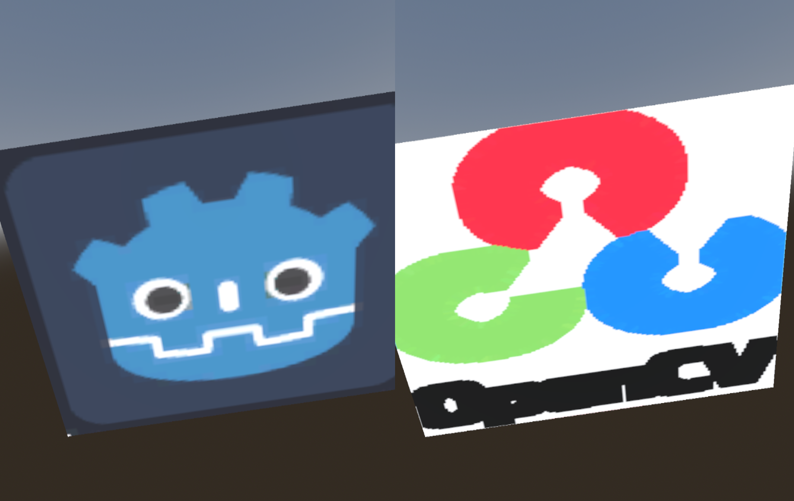

# godot_left_right_independent_images
Demonstration of displaying independent images in the left and right views with Godot 4.1.2's shaders

Based on [https://github.com/godotengine/godot/pull/48011](https://github.com/godotengine/godot/pull/48011).

The output looks like this:

